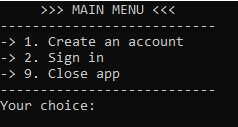
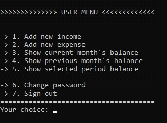
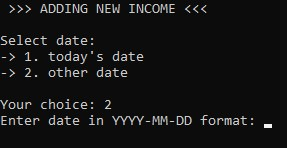
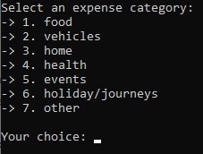
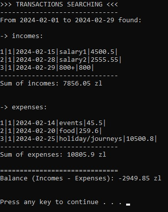

# ParsonalBudget - Object Oriented

Final version of the PersonalBudget application written in OOP paradigm.\
[Here](https://github.com/mateusz-przybyla/PersonalBudget_Structured) you can find the PersonalBudget application written in structured paradigm.

## Table of contents

- [Overview](#overview)
  - [About](#about)
  - [Application design](#plan-freemind)
  - [Diagram UML](#diagram-uml)
  - [Screenshot](#screenshot)
- [My process](#my-process)
  - [Built with](#built-with)
  - [Useful resources](#useful-resources)

## Overview

### About

PersonalBudget application allows you to keep records of your expenses and incomes.
Data are saved to the database (.xml file).
First create a user account and then you can add incomes and expenses with today's date or with a selected backdate.
You can show current month's balalnce, previous month's balance and selected period balance. The application calculates the sum of incomes, expenses and the difference between them (incomes - expenses).

Other functionalities:

- Changing user password

### Application design

[Plan FreeMind](https://github.com/mateusz-przybyla/PersonalBudget_ObjectOriented/blob/main/PersonalBudget_Plan-FreeMind.pdf)

### Diagram UML

[Diagram UML](https://github.com/mateusz-przybyla/PersonalBudget_ObjectOriented/blob/main/PersonalBudget_uml.pdf)

### Screenshots

- Main menu:\
  

- User menu:\
  

- Adding new income:\
  

- Expense category:\
  

- e.g. Previous month's balance:\
  

## My process

### Built with

- OOP (Object Orienting Programming)
- Operations on dates
- Vectors
- Pointers
- Input/output with files (.xml)
- Libraries: vector, ctime, sstream, iomanip, math.h, algorithm
- External library: Markup
- Clean code
- SOLID Principles (especially Single Responsibility Principle)

### Useful resources

- Project Przyszly Programista
- https://www.geeksforgeeks.org
- https://miroslawzelent.pl/kurs-c++/
- https://stackoverflow.com
- https://www.firstobject.com/dn_markup.htm
- https://www.tutorialspoint.com/cplusplus/cpp_date_time.htm
